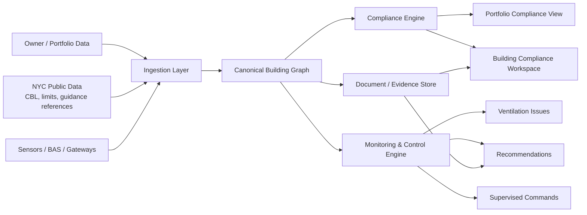

# AirWise Technical Implementation Plan

## LL97 Compliance Engine + Ventilation Monitoring and Supervised Control

Last updated: 2026-04-14

## 1. Objective

Build AirWise as a multi-tenant SaaS platform with two product engines on top of a shared building graph:

- `Compliance engine`: determines LL97 coverage, pathway, filing requirements, evidence state, deadlines, and risk for each building.
- `Monitoring/control engine`: reads ventilation-related telemetry, detects operational issues, recommends actions, and later supports limited supervised BACnet write-back for approved points.

The initial customer is a `NYC owner / asset manager` operating a multifamily or affordable portfolio. The initial pilot should support:

- Article 320 buildings
- Article 321 buildings
- portfolio-level compliance ranking
- building-level workspaces
- ventilation issue detection in centrally controlled systems
- operator action tracking and before/after measurement

## 2. Product boundaries

### In scope for v1

- Building identity resolution by `BBL + BIN + address`
- Covered-building and pathway mapping
- Article 320 filing-readiness workflow
- Article 321 performance and PECM workflow
- Evidence/document management tied to compliance requirements
- Portfolio dashboard and building scorecards
- Sensor ingestion and BACnet discovery/read
- Deterministic ventilation issue detection
- Recommendation workflows
- Supervised write-back for whitelisted points in pilot buildings only

### Out of scope for v1

- Free-form legal/compliance advice
- Fully autonomous closed-loop control
- Broad protocol support beyond BACnet-first integrations
- Apartment-local fan optimization without central controls
- Automated inference of Article 321 PECM compliance from sensors alone
- Advanced Article 320 deduction/alternative logic beyond structured modules

## 3. Architecture

### Core services

- `Identity service`: resolves buildings and owners across public and customer data.
- `Coverage service`: determines LL97 pathway and confidence state.
- `Compliance service`: generates requirements, due dates, checklists, and penalty calculations.
- `Document service`: stores raw documents, extracted metadata, and evidence links.
- `Telemetry service`: ingests raw sensor and BAS data.
- `BAS service`: discovers and normalizes BACnet devices and points.
- `Issue service`: produces ventilation issues from telemetry and schedules.
- `Recommendation service`: turns issues into actions and tracks outcomes.
- `Command service`: handles approval-based BAS writes, rollback, and audit logs.

## 4. Delivery phases

### Phase 0: Requirements and pilot archetypes

Duration: `2-3 weeks`

Outputs:

- LL97 rules matrix for Article 320 and 321
- compliance pathway mapping table
- building archetype matrix
- ventilation system archetype matrix
- BACnet point taxonomy
- command safety policy
- pilot intake checklist

Exit criteria:

- every pilot building can be mapped to a pathway and a ventilation archetype
- approved writable points can be identified before any write-back feature is enabled

### Phase 1: Building graph + compliance MVP

Duration: `4-6 weeks`

Outputs:

- portfolio import
- building identity resolution
- covered-building and pathway resolver
- compliance requirements generator
- building compliance workspace
- document upload and evidence binding
- portfolio dashboard

Exit criteria:

- pilot buildings can be imported and rendered in a compliance workspace without manual spreadsheets
- each building shows pathway, next steps, blocker list, and evidence state

### Phase 2: Monitoring MVP

Duration: `4-6 weeks`

Outputs:

- sensor ingestion API
- BACnet discovery/read adapter
- time-series storage
- issue rules
- recommendation workflow
- before/after measurement views

Exit criteria:

- one pilot building produces real ventilation issues with evidence and operator actions

### Phase 3: Supervised control pilot

Duration: `4-6 weeks`

Outputs:

- whitelisted point registry
- approval workflow
- command execution with rollback
- point-level audit logs
- building-specific write policies

Exit criteria:

- a temporary approved schedule/setpoint write can be executed, verified, and rolled back safely

### Phase 4: Productization and rollout decision

Duration: `4 weeks`

Outputs:

- pilot results package
- recommendation conversion metrics
- operator adoption metrics
- decision memo on Modbus support and broader automation

Exit criteria:

- measurable workflow value is proven before broader control automation is enabled

## 5. Initial technical stack

Recommended MVP stack:

- `Frontend`: Next.js + TypeScript
- `Backend API`: Node.js / TypeScript
- `Database`: Postgres
- `Object storage`: S3-compatible bucket
- `Time-series`: Postgres hypertables or TimescaleDB
- `Queue / jobs`: BullMQ or equivalent
- `Auth`: managed auth with tenant-aware RBAC
- `Observability`: structured logs, traces, metric dashboards

The implementation should favor product speed and auditability over distributed-system complexity.

## 6. Key engineering decisions

- Use deterministic rules for compliance and issue detection first.
- Represent uncertainty explicitly with `confidence`, `source`, and `missing inputs`.
- Keep all filing-related dates and rule parameters in configuration tables, not hardcoded logic.
- Treat `BBL` as the lot-level key and `BIN` as the building-level key; keep both.
- Treat BACnet writes as privileged, reversible operations with full audit requirements.
- Do not imply AirWise is the certifying authority; licensed professionals remain in the loop.

## 7. Acceptance criteria

The implementation is ready for pilot when:

- a portfolio can be imported and automatically resolved to pathways
- Article 320 and Article 321 workspaces are usable on real buildings
- at least one ventilation system can be monitored end-to-end
- recommendations can be assigned, executed by operators, and measured
- write-back remains disabled by default and only works for approved pilot points

## 8. Source anchors

The implementation should be anchored on official DOB/HPD materials and treated as configuration-driven so updates can be absorbed without code rewrites.

- LL97 overview: <https://www.nyc.gov/site/buildings/codes/ll97-greenhouse-gas-emissions-reductions.page>
- Emissions limits: <https://www.nyc.gov/site/buildings/codes/ll97-buildings-emissions-limits.page>
- Covered buildings FAQ / pathway tiers: <https://www.nyc.gov/site/buildings/codes/ll97-cbl-faq.page>
- Violations and penalties: <https://www.nyc.gov/site/buildings/codes/greenhouse-gas-emissions-reductions-violations.page>
- LL97 compliance report process: <https://www.nyc.gov/assets/buildings/pdf/ll97-compliance-report-process.pdf>
- Article 321 filing guide: <https://www.nyc.gov/assets/buildings/pdf/321_filing_guide.pdf>
- Article 321 template instructions: <https://www.nyc.gov/assets/buildings/pdf/article321_temp_instr.pdf>
- HPD affordable housing guidance: <https://www.nyc.gov/site/hpd/services-and-information/ll97-guidance-for-affordable-housing.page>
- 2026 Covered Buildings List reference: <https://home4.nyc.gov/assets/buildings/pdf/cbl_mn26.pdf>
- ASHRAE control guidance for DCV concepts: <https://handbook.ashrae.org/Handbooks/A19/SI/a19_ch48/a19_ch48_si.aspx>
