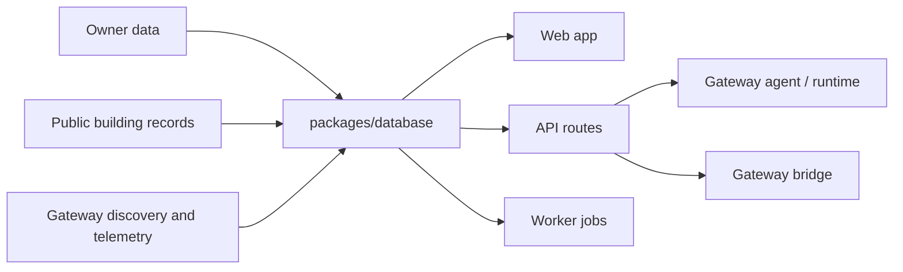

# AirWise Technical Implementation Plan

Last updated: 2026-04-15

## Objective

AirWise is currently implemented as a pilot-stage monorepo with two major engines on top of a shared building record:

- compliance and filing
- monitoring and supervised operations

## Current architecture

## What is implemented now

### Shared application core

- local SQLite persistence via `node:sqlite`
- schema migrations and seed config in `packages/database`
- shared domain types and deterministic rules packages

### Web layer

- session-based access control
- portfolio dashboard
- overview, filing, compliance, documents, monitoring, and recommendations workspaces
- owner/operator command workspace
- owner-only import review page

### API layer

- Fastify HTTP surface for product workflows
- gateway runtime token contract
- reporting-cycle and calculation endpoints

### Worker layer

- local job runner for coverage, requirements, telemetry, discovery, issues, dispatch, and runtime health

### Gateway-side runtimes

- gateway agent that talks directly to the runtime contract
- gateway bridge with simulated, file-feed, SDK, and provider-backed modes

## Current implementation choices

- local-first SQLite over production database infrastructure
- package-centric business logic over heavy service decomposition
- deterministic rules over AI-first workflow control
- approval-based supervised commands over autonomous optimization

## Current boundaries

- not production infra
- not production auth
- not a full external filing submission system
- not a generalized controls platform
