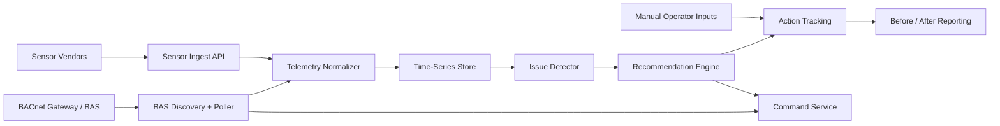

# AirWise Ventilation Monitoring and BACnet Specification

Last updated: 2026-04-14

## 1. Goal

Build a `read-first, recommend-first, supervised-write second` ventilation product for centrally controlled systems in NYC multifamily and affordable buildings.

The first release must help building teams:

- see how ventilation equipment is actually operating
- detect obvious runtime and schedule issues
- receive evidence-backed actions
- measure before/after outcomes

The system must not behave like a black-box autonomous controls vendor in v1.

## 2. Target systems

### In scope

- central exhaust fans
- make-up air units
- common-area AHUs
- corridor ventilation systems
- garage exhaust and make-up systems
- BAS-exposed schedules, modes, runtimes, and supporting points

### Out of scope

- apartment-local bath fans with no central control
- PTAC-level ventilation without BAS visibility
- bespoke controls retrofits that need heavy SI work before product value appears
- unrestricted writes to safety-critical sequences

## 3. Why this wedge fits Article 321

The ventilation wedge is not just an operations feature. It also aligns with Article 321 prescriptive workflows, especially:

- `PECM #12 Exhaust fan timers`
- `PECM #7 Indoor/outdoor temperature sensors` where controls evidence is relevant
- broader heating/load interactions described in DOB guidance

This makes ventilation valuable in two ways:

- reduce waste and improve operational discipline
- generate better evidence and task workflows for compliance-related building operations

## 4. Monitoring architecture

### Required signals

Prefer these point types in v1:

- fan command
- fan status / proof of run
- occupancy mode
- schedule
- CO2
- temperature
- humidity
- damper position where applicable
- airflow proxy where available
- alarm state
- manual override state

### Canonical telemetry event

Fields:

- `building_id`
- `system_id`
- `zone_id` nullable
- `point_id`
- `point_type`
- `timestamp`
- `value`
- `unit`
- `quality_flag`
- `source_protocol`

## 5. BACnet implementation path

### Phase A: discovery and read-only

Capabilities:

- network/device discovery
- object inventory
- writable capability detection
- unit normalization
- schedule and status polling
- trend capture

Store per point:

- object identifier
- object name
- present value type
- units
- write support
- candidate canonical type
- safety category

### Phase B: recommendations

Use deterministic rules to detect:

- after-hours fan runtime
- occupied/unoccupied schedule mismatch
- likely over-ventilation during low-load windows
- high CO2 combined with low ventilation signals
- stale manual overrides
- flatlined sensors
- missing or suspect schedule data

Recommendation payload:

- issue title
- evidence window
- recommended action
- expected effect
- write-back eligible yes/no
- confidence
- human validation note

### Phase C: supervised write-back

Allow writes only when:

- the building is pilot-approved
- the point is whitelisted
- the command type is approved
- a user with write permission approves
- rollback/expiry is defined

Supported write categories in v1:

- schedule enable/disable window
- occupancy mode toggle
- bounded setpoint update
- temporary override with expiry

Never allow in v1:

- life-safety points
- fire/smoke control points
- unrestricted sequence rewrites
- writes to unclassified points

## 6. Command safety policy

Every command must have:

- requestor
- approver
- reason
- target point
- original value
- requested value
- start time
- expiry time
- rollback mode
- execution status

Default behavior:

- no write permission outside pilot buildings
- commands expire automatically
- rollback runs automatically on expiry unless explicitly converted into a permanent approved schedule change

## 7. Initial issue rules

### Rule 1: after-hours runtime

Trigger:

- fan status on outside occupied schedule for more than configured threshold

Evidence:

- scheduled occupancy window
- runtime history
- trend over trailing 7 days

Recommended action:

- inspect schedule
- remove stale override
- reduce occupied runtime window if approved

### Rule 2: schedule mismatch

Trigger:

- commanded mode is unoccupied but runtime remains high

Evidence:

- mode point
- proof-of-run point
- alarm/override state

Recommended action:

- inspect override state
- verify BAS sequence
- schedule a temporary supervised correction if approved

### Rule 3: high CO2 / insufficient ventilation

Trigger:

- elevated CO2 during occupied hours while airflow proxy or fan state suggests under-ventilation

Evidence:

- CO2 trend
- occupancy window
- fan/damper data

Recommended action:

- inspect sensors
- verify minimum outdoor air / exhaust operation
- escalate for engineering review if persistent

### Rule 4: low occupancy proxy with high ventilation runtime

Trigger:

- low CO2 / low occupancy proxy during occupied or shoulder periods with sustained high runtime

Recommended action:

- consider schedule reduction
- inspect minimum flow / timer strategy

### Rule 5: stale override

Trigger:

- manual override persists beyond normal duration

Recommended action:

- clear override
- review reason and permanent schedule need

### Rule 6: sensor fault

Trigger:

- flatline, missing samples, or physically implausible values

Recommended action:

- inspect and recalibrate or replace sensor
- suppress ventilation optimization decisions until repaired

## 8. Before/after measurement

For each executed operator action or supervised command, AirWise should create a measurement record:

- baseline window
- intervention window
- post-intervention window
- affected equipment and zones
- runtime delta
- alarm delta
- air-quality delta
- operator note

In v1, the outcome story should be operational:

- less unnecessary runtime
- improved schedule alignment
- better evidence of control discipline

Do not present guaranteed energy savings from sparse pilot data.

## 9. Pilot onboarding checklist

Per building/system:

- BAS vendor and access method
- protocol and network details
- gateway availability
- point list export if available
- equipment list
- control drawings or sequence notes if available
- occupied schedules
- write permissions and governance
- life-safety exclusions

## 10. Non-functional requirements

- commands are disabled by default
- telemetry loss never triggers unsafe writes
- sensor faults degrade to alert-only mode
- all point mappings are reviewable by an engineer/operator
- every recommendation is traceable to data

## 11. Source anchors and technical references

- Article 321 filing guide: <https://www.nyc.gov/assets/buildings/pdf/321_filing_guide.pdf>
- Article 321 template instructions: <https://www.nyc.gov/assets/buildings/pdf/article321_temp_instr.pdf>
- HPD affordable housing guidance: <https://www.nyc.gov/site/hpd/services-and-information/ll97-guidance-for-affordable-housing.page>
- ASHRAE controls handbook chapter: <https://handbook.ashrae.org/Handbooks/A19/SI/a19_ch48/a19_ch48_si.aspx>
- ASHRAE fundamentals of control chapter: <https://handbook.ashrae.org/Handbooks/F17/IP/f17_ch07/f17_ch07_ip.aspx>
- ASHRAE 62.1 interpretation on DCV usage: <https://www.ashrae.org/File%20Library/Technical%20Resources/Standards%20and%20Guidelines/Standards%20Intepretations/IC_62-1-2004-06.pdf>
